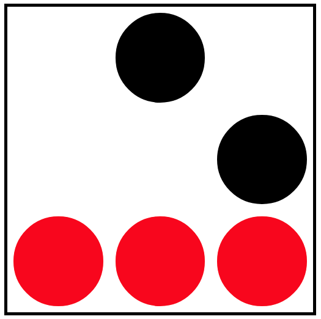

# Task \#4

This task tests you on your ability to construct a javascript query selector. Consider the following:

```html
<!DOCTYPE html>
<html>
	<head>
		<title>Task #4</title>
		<style>
			#main {
				height: 500px;
				width: 500px;
				margin: auto;
				border: solid 5px black;
				display: flex;
				flex-wrap: wrap;
			}
			p {
				height: calc( 100% / 3 );
				width: calc( 100% / 3 );
				background: #FFF;
				margin: 0;
				border: solid 10px #FFF;
				border-radius: 50%;
				box-sizing: border-box;
			}
			p.filled {
				background: #000;
			}
		</style>
	</head>
	<body>
		<div id="main" >
			<p></p>
			<p class="filled" ></p>
			<p></p>
			<p></p>
			<p></p>
			<p class="filled" ></p>
			<p class="filled" ></p>
			<p class="filled" ></p>
			<p class="filled" ></p>
		</div>
		<script>
			document.querySelectorAll ("YOUR ANSWER HERE").forEach ( node => node.style = "background: red" )
		</script>
	</body>
</html>
```

Your objective is to construct a query selector that will color only the last row red. It should look like the following:


